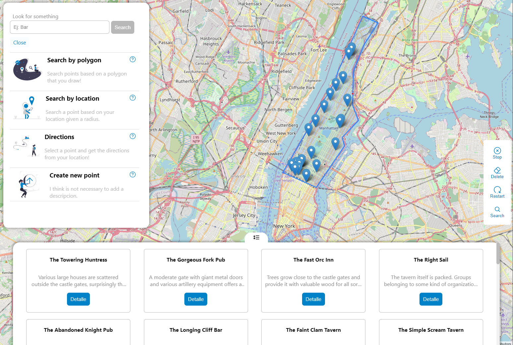

## :rocket: React-Maps

### :memo: Description

Web application to manage geographic information throw Leaflet library and OpenStreetMap layer.

### :sparkles: Features

- Search points
- Geocoding

### :alembic: Core Concepts

- Geographic Information System

### :construction: Made with

- React ^17.0.2
- Sass ^1.49.9
- Leaflet: ^1.7.1
- React-leaflet: ^3.2.5
- vite: ^2.8.0

### :bulb: Run the App

To run locally, clone the repo, execute `npm install` and then `npm run dev`.

_If you want to contribute to improve the project, please create your PR and write me :speech_balloon: . After it, sit down and take a beer, you deserve it!_ :beers: .
_This project is for academic purposes only, all right reserved. Andrés Andrade 2022 :copyright::registered:_
